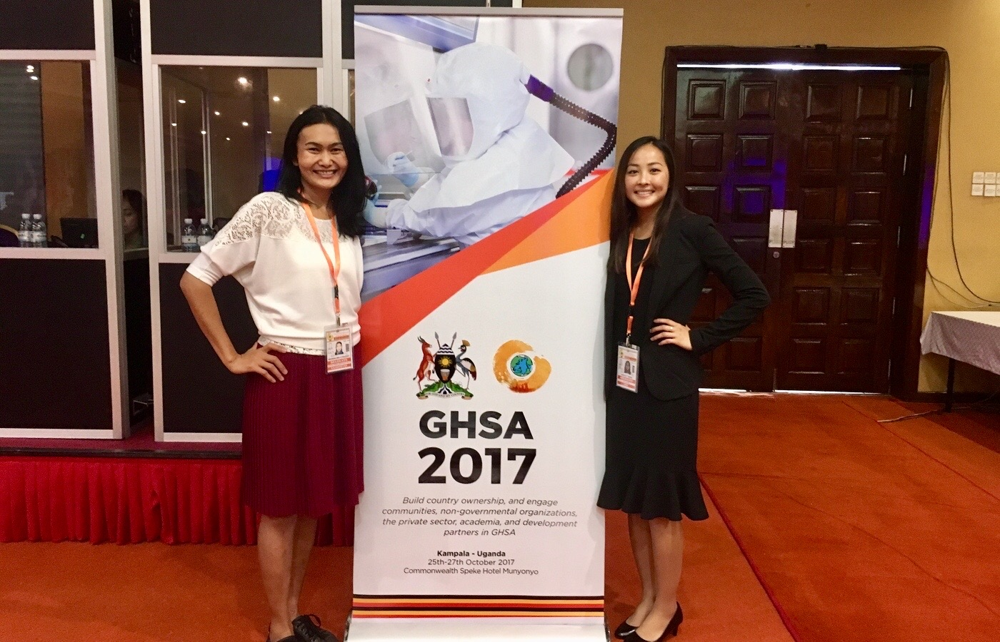

---

My interest in infectious disease research stems primarily from my work with the Global Health Security Agenda (GHSA) and my involvement with the Next Generation Global Health Security Network. The GHSA was launched in 2014 to provide a framework to pursue nine related objectives for detecting, preventing, and responding to future infectious disease outbreaks and improving preparedness. Although there is an abundance of global health security resources available, there is no straightforward protocol to follow or central location for countries to access them. To address these gaps, I submitted the winning proposal to the Nuclear Threat Initiative’s Next Generation for Biosecurity in GHSA 2017 Competition to help users worldwide meet the biosecurity targets outlined in the GHSA. As a result of my work in the competition, I was invited to be a competition proposal judge for the past three years. Furthermore, I have collaborated with researchers globally on manuscripts related to the significance of biosecurity, biosafety, and data-sharing.