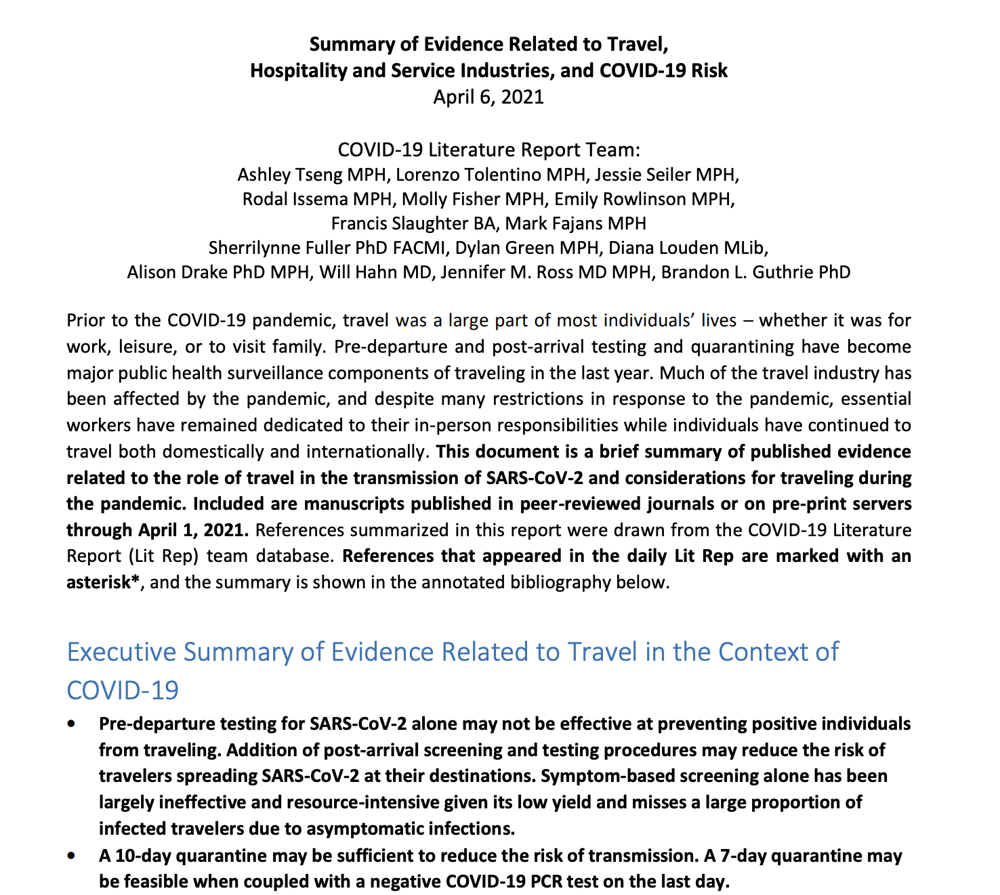

---
author:
categories:
date: "2022-07-01"
draft: false
excerpt: Engagement in public health preparedness and response work
featured: true
layout: single
links:
- icon: door-open
  icon_pack: fas
  name: website
  url: https://depts.washington.edu/pandemicalliance/covid-19-literature-report/in-depth-reports/
subtitle: "Engagement in public health preparedness and response work"
tags:
title: Public Health Practice
---

---

One of the reasons I have embarked on such rigorous academic training is to be able to step up in situations where I can leverage my skillsets to help with a public health problem. While working at the National Center for Disaster Preparedness in 2019, I built an open-access topical application using ArcGIS for Federal Emergency Management Agency community housing recovery trainings throughout the US in preparation for natural disasters. At the onset of the COVID-19 pandemic, I found myself looking for ways to help with the pandemic response. First, I volunteered with the Information Services Team of the Columbia University COVID-19 Student Service Corps (CSSC), translating and proofreading educational materials on COVID-19 from English to Chinese to be distributed across Chinese-speaking communities in New York City. As I transitioned from Columbia University to University of Washington, I started working on the University of Washington Alliance for Pandemic Preparedness COVID-19 Literature Situation Report, contributing to the rapid production of daily summaries and in-depth reports of literature related to the COVID-19 outbreak. In the first year of my PhD, I was also accepted to the University of Washington Student Epidemic Action Leaders Team, through which I was sent on public health deployments to the Washington State Department of Health and to the Chelan-Douglas Health District to provide epidemiology expertise for COVID-19-related work.